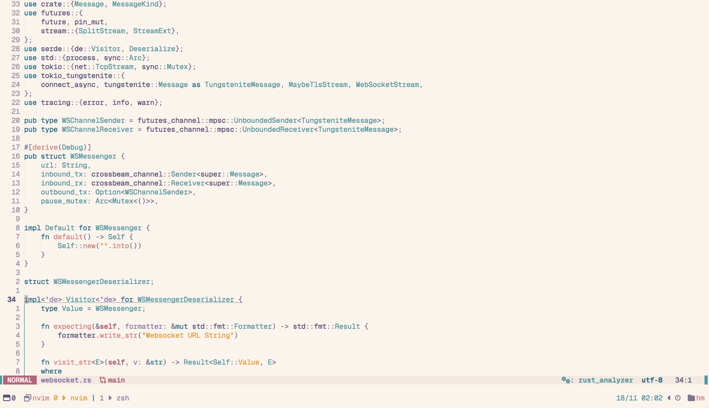

# nvim
A really simple Neovim config that helps me get work done.

## Plugins
Here's an overview of a couple notable plugins I depend on:

- **Lualine** - Simple yet informative status line.
- **Neorg** - For note taking and some journaling on the side.
- **Trouble** - Helps me look at file level and project level diagnostic info.
- **Telescope** - Switching between buffers and for project level file search.

## Theme
Been using Rosé Pine since day one. Switched to light theme recently.
< 
