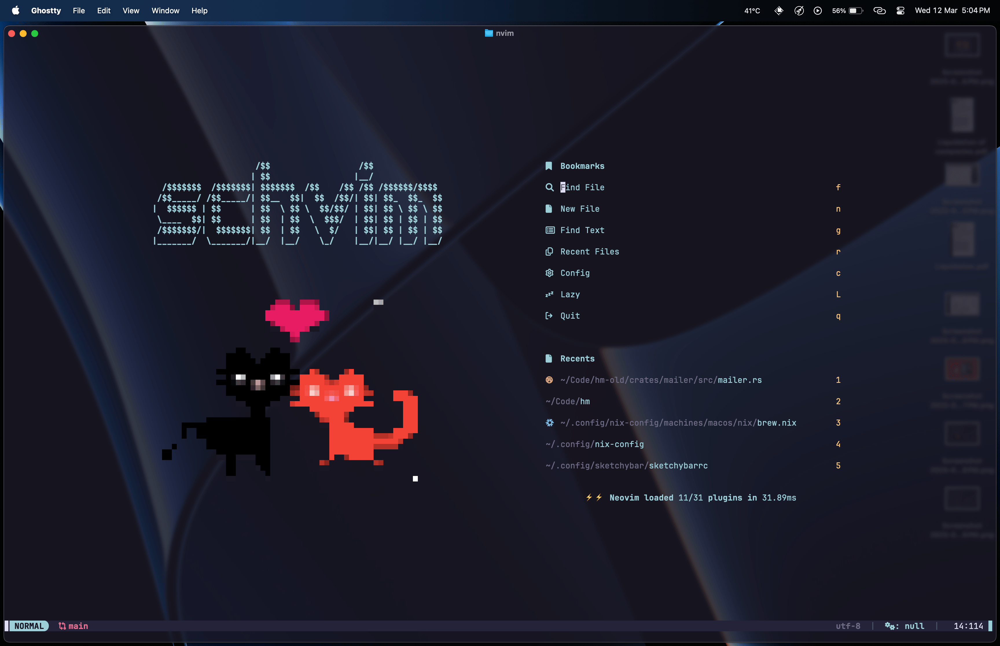
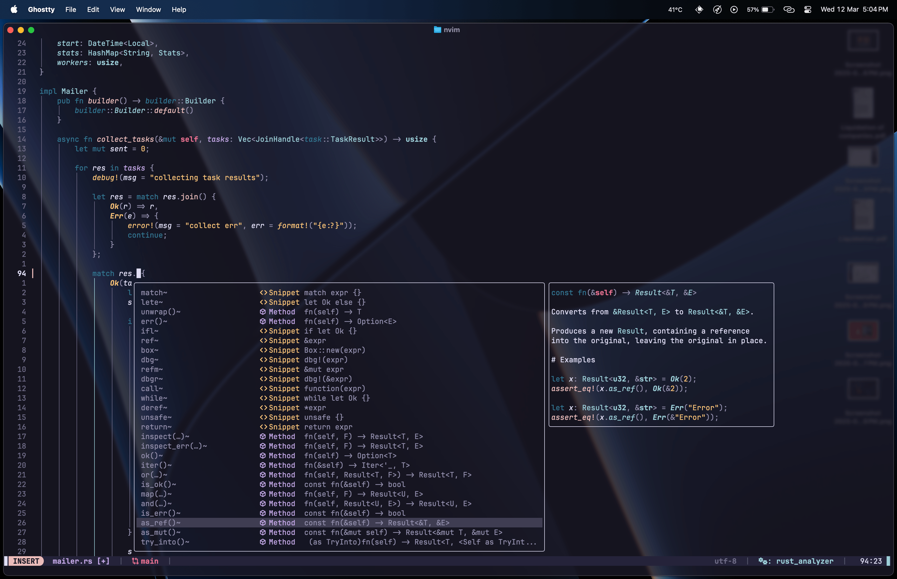

# nvim
My Neovim configuration.

Dashboard                       |  Editor
:------------------------------:|:------------------------------:
  |  

## Setup

- **Clone the repo:**
```bash
git clone https://github.com/devsheke/nvim ~/.config/nvim --depth 1
```

- **Setup Lua LSP tools with direnv (Optional for Nix/Nix-darwin users):**
```bash
direnv allow && echo "use flake" > .envrc
```

- **Start Neovim:**
  
Everything will be setup/installed by [Lazy.nvim](https://github.com/folke/lazy.nvim) on your first run automatically.

```bash
nvim
```
